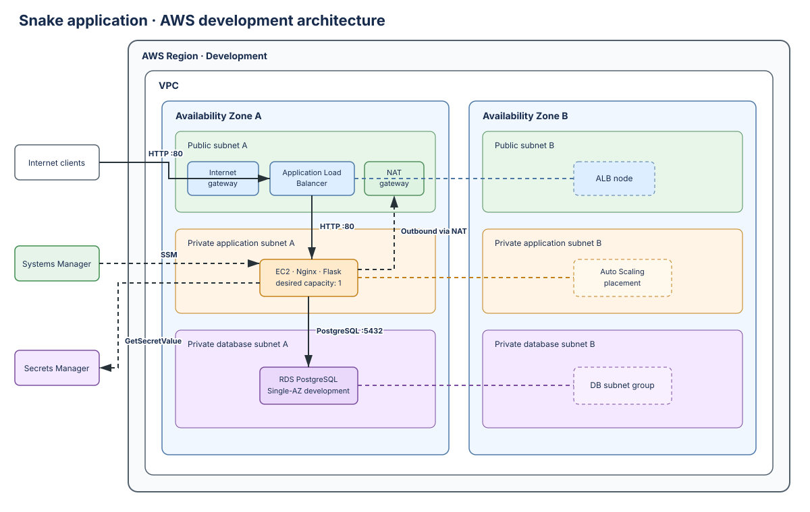

# Multi-Environment Architecture

## Overview

The deployed development environment uses a three-tier AWS architecture across
two Availability Zones. Only the Application Load Balancer accepts public
application traffic. EC2 instances and RDS remain in private subnets.

## Request Flow

1. A browser sends HTTP traffic to the public Application Load Balancer.
2. The port 80 listener forwards to healthy Nginx targets on port 80.
3. Nginx proxies application requests to Gunicorn and Flask.
4. Flask retrieves database credentials through the EC2 role and stores scores
   in RDS PostgreSQL.

The target group checks `/health`. That endpoint returns success only when Flask
can query PostgreSQL, so the load balancer routes traffic only to instances with
a working application-to-database path.

## Network Layout

Each Availability Zone contains a public subnet, a private application subnet,
and a private database subnet. The load balancer spans both public subnets. The
Auto Scaling group spans both application subnets, and the RDS subnet group spans
both database subnets.

An internet gateway serves the public tier. A single development NAT gateway in
the first public subnet provides outbound package and AWS API access for private
application instances. Database route tables have no internet route.

## Compute and Application

The Auto Scaling group currently maintains one `t3.micro` instance and may scale
to two. Instances have no public IP address and use an Amazon Linux 2023 launch
template with IMDSv2 and encrypted EBS. Cloud-init installs Nginx, Gunicorn, and
the Flask Snake application.

The game stores only an integer score and creation timestamp. Multiple instances
can safely initialize the same table with `CREATE TABLE IF NOT EXISTS`.

## Database and Secrets

Development uses an encrypted Single-AZ RDS PostgreSQL instance in private
database subnets. RDS manages the master credential in Secrets Manager. The EC2
role can retrieve the configured secret; secret values are not embedded in
Terraform state, launch-template user data, or browser responses.

## Security and Administration

Traffic follows security-group references rather than public instance rules:

1. Internet clients reach the load balancer on TCP port 80.
2. The application tier accepts TCP port 80 only from the load balancer group.
3. RDS accepts TCP port 5432 only from the application group.

Systems Manager provides administrative access without SSH keys, inbound SSH, or
public instance addresses.

## State Management

The development root stores state in an encrypted, versioned S3 bucket with
native S3 lock files. Bootstrap and development state remain separate. Local
`backend.hcl` and `terraform.tfvars` files are ignored by Git.

## Observability

Each environment creates three CloudWatch log groups for the Snake application,
Nginx, and cloud-init. The EC2 role can write only to those environment-specific
groups. Development retains these logs for 7 days; production retains them for
30 days.

Five CloudWatch alarms cover unhealthy ALB targets, insufficient Auto Scaling
capacity, high EC2 CPU, high RDS CPU, and low RDS free storage. The alarms do not
have notification actions, and no dashboard is configured.

## Availability and Cost Choices

The ALB and Auto Scaling group span two Availability Zones. Development keeps one
EC2 instance, one NAT gateway, and a Single-AZ RDS instance to control cost. The
Auto Scaling group replaces failed instances, but a single desired instance does
not provide uninterrupted compute availability during replacement.

## Production Design

The production root reuses the same three-tier modules in a separate VPC and
state object. It creates one NAT gateway per Availability Zone, configures RDS
for Multi-AZ operation with 30-day backups and deletion protection, and maintains
two EC2 instances with an Auto Scaling range of 2–4. The load balancer accepts
HTTP only from explicitly approved CIDRs, and its unused port 443 ingress is
disabled.

This configuration has been validated and tested with mocked providers but has
not been applied. No production AWS resources exist as part of this stage.

## Scope

HTTPS, Route 53, a custom domain, CloudWatch application/system log shipping, and
alarms are outside the current implementation.
